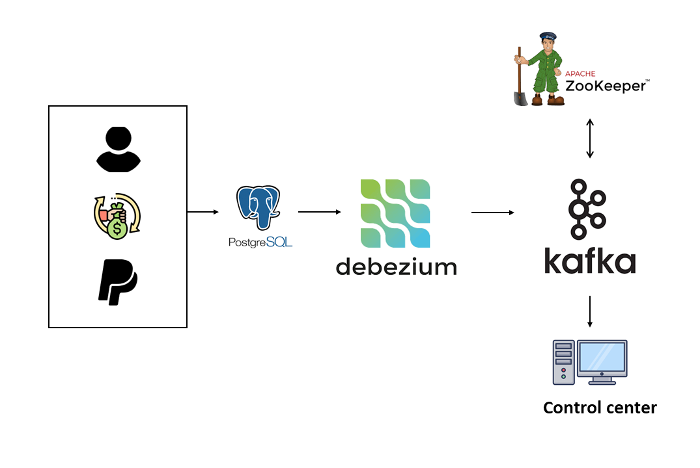

# CDC with Debezium, Kafka, Postgres, Docker

## Overview
This project demonstrates the implementation of a Change Data Capture (CDC) system using Debezium, Kafka, Postgres, and Docker. The system generates simulated financial transactions using a Python script and inserts them into a PostgreSQL database. It is particularly useful for setting up a test environment for CDC with Debezium. The script uses the faker library to create realistic yet fictitious transaction data.

## System Architecture


## Prerequisites
Before running this script, make sure you have the following installed:
- Python 3.9+
- The `psycopg2` library for Python
- The `faker` library for Python
- A locally running or remotely accessible PostgreSQL server
- Docker and Docker Compose

## Installation
### Install Required Python Libraries
You can install the required libraries using pip:

```
pip install -r requirements.txt
```
### Docker Services
The Docker Compose file included in this repository sets up the following services:

#### Zookeeper: 
A centralized service for maintaining configuration information, naming, providing distributed synchronization, and providing group services.
#### Kafka Broker: 
A distributed streaming platform used for handling real-time data feeds.
Confluent Control Center: A web-based tool for managing and monitoring Apache Kafka.
#### Debezium: 
An open-source distributed platform for change data capture.
#### Debezium UI: 
A user interface for managing and monitoring Debezium connectors.
#### Postgres: 
An open-source relational database.
## Getting Started
Clone the Repository: If this Docker Compose file is not already on your local system, clone the repository to your machine.
Navigate to the Directory: Open a terminal and navigate to the directory containing the Docker Compose file.
Run Docker Compose: Execute the following command to start all services defined in the Docker Compose file:
bash
```
docker-compose up -d
```

This command will download the necessary Docker images, create containers, and start the services in detached mode.

Verify the Services: Check if all the services are up and running:

```
docker-compose ps
```
You should see all services listed as 'running'.

### Accessing the Services:
   - Kafka Control Center is accessible at `http://localhost:9021`.
   - Debezium UI is accessible at `http://localhost:8080`.
   - Postgres is accessible on the default port `5432`.

### Shutting Down
To stop and remove the containers, networks, and volumes, run:


```
docker-compose down
```
## Customization
You can modify the Docker Compose file to suit your needs. For example, you might want to persist data in Postgres by adding a volume for the Postgres service.

⚠️ Note This setup is intended for development and testing purposes. For production environments, consider additional factors like security, scalability, and data persistence.

## References
[Debezium Documentation](https://debezium.io/documentation/reference/stable/index.html)
[Kafka Documentation](https://kafka.apache.org/documentation/)
[Python Faker](https://faker.readthedocs.io/en/master/)

## 📧Contact
Please feel free to contact me if you have any questions.
<a href="https://ducanh0285@gmail.com" target="blank"></a><a href="https://www.facebook.com/ducanh.pp" target="blank"></a><a href="https://twitter.com/Ducann02Nguyen" target="blank"></a><a href="https://www.linkedin.com/in/ducanhnt/" target="blank"></a>
